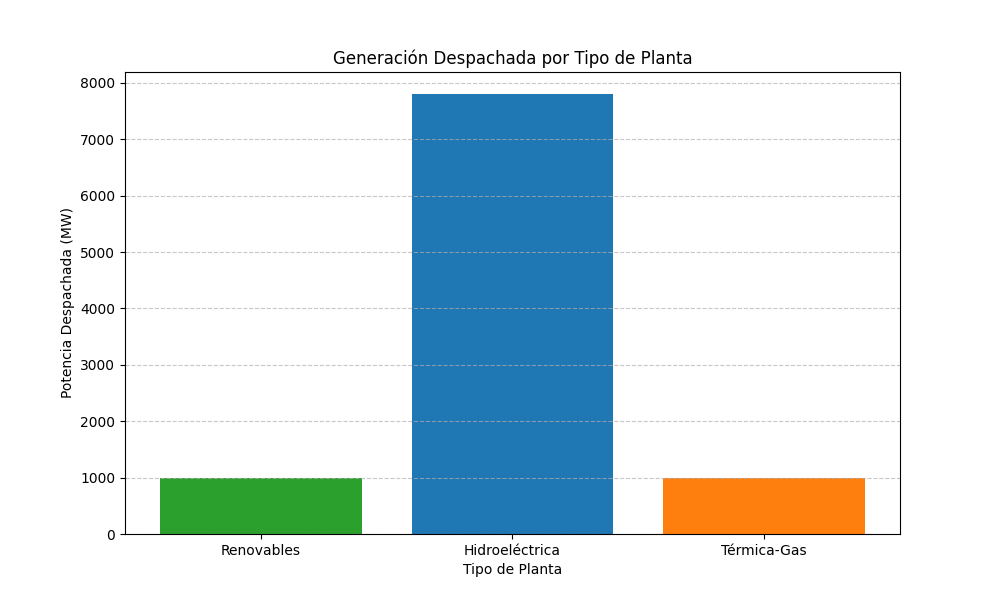
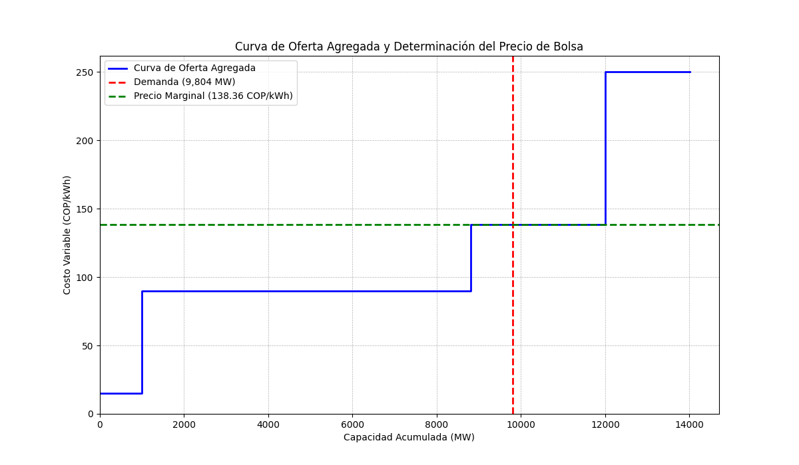

# Presentación: Simulación de Despacho Económico para el Mercado Eléctrico Colombiano

---

## 1. Introducción

### Objetivo del Proyecto
El objetivo de este proyecto es desarrollar un modelo de despacho económico simplificado que refleje las características y dinámicas del mercado de energía mayorista en Colombia. A través de un script en Python, se busca determinar qué plantas de generación deben operar para satisfacer la demanda de energía al menor costo posible, y cómo se forma el precio de la energía en la bolsa.

### El Problema del Despacho Económico
El despacho económico es un problema de optimización fundamental en los sistemas de potencia. Consiste en asignar la producción de energía entre los generadores disponibles para cubrir la demanda del sistema de la manera más económica posible, respetando las restricciones operativas de cada generador y de la red.

---

## 2. Conceptos Clave del Mercado Eléctrico Colombiano

Nuestro modelo incorpora tres conceptos fundamentales del mercado colombiano:

### a. Orden de Mérito
No todos los generadores tienen el mismo costo de producción. El **orden de mérito** es el principio según el cual los generadores se despachan en orden ascendente de su costo variable de operación. Las plantas más baratas (como las renovables y las hidroeléctricas) se despachan primero, y se recurre a las más caras (como las térmicas) solo cuando las primeras no son suficientes para cubrir la demanda.

### b. Precio de Bolsa (Precio Marginal)
En un mercado marginalista como el colombiano, el precio de la energía para todos los participantes en una hora determinada no es un promedio, sino que es fijado por el costo del **último generador (el más caro) que fue necesario despachar** para satisfacer la demanda. A este precio se le conoce como Precio Marginal del Sistema (PMS) o Precio de Bolsa.

### c. Precio de Escasez
Es un precio máximo regulado para la energía en la bolsa. Se activa cuando la oferta de los generadores disponibles no es suficiente para cubrir la demanda, indicando una situación de déficit o escasez de energía. Actúa como una señal de seguridad para el sistema y un incentivo para la inversión en nueva capacidad de generación. En nuestro modelo, lo representamos como un "generador de déficit" con un costo muy alto.

---

## 3. El Modelo: Simulación para Julio de 2025

Para hacer el modelo realista, utilizamos datos públicos del mercado colombiano para un mes específico.

*   **Periodo de Simulación:** Julio de 2025.
*   **Demanda Total Mensual:** 7,294.30 GWh.
*   **Demanda Horaria Promedio:** `(7,294.30 * 1000) / (31 * 24) = 9,804 MW`. Esta es la demanda que nuestro modelo debe satisfacer.
*   **Precio de Bolsa Objetivo:** 138.36 COP/kWh.
*   **Precio de Escasez (Superior):** 865.22 COP/kWh.

### Escenario de Despacho
Para que el precio de bolsa sea de 138.36 COP/kWh, la planta térmica a gas debe ser la que fije el precio. Esto requiere simular un escenario donde la generación hidroeléctrica (más barata) sea insuficiente. Esta es una condición realista durante temporadas de bajos aportes hídricos.

### Generadores del Modelo
| Planta           | Costo Variable (COP/kWh) | Capacidad Disponible (MW) | Rol en el Modelo                               |
|------------------|--------------------------|---------------------------|------------------------------------------------|
| **Renovables**   | 15.00                    | 1,000                     | La más barata, se despacha siempre primero.    |
| **Hidroeléctrica**| 90.00                    | 7,804                     | Barata, pero con disponibilidad limitada.      |
| **Térmica-Gas**  | **138.36**               | 3,200                     | **Planta marginal:** fija el precio de bolsa.  |
| **Térmica-Carbón**| 250.00                   | 2,000                     | Más cara, solo se usa si las otras no bastan.|
| **Déficit**      | **865.22**               | Ilimitada                 | Virtual, representa el Precio de Escasez.      |

---

## 4. La Solución en Python: Un Recorrido por el Código

El problema se resuelve usando programación lineal. El código completo se encuentra en el archivo `caso`.

### a. Dependencias
-   **`scipy.optimize.linprog`**: Es el corazón del modelo. Resuelve problemas de optimización lineal para encontrar la solución de mínimo costo.
-   **`matplotlib.pyplot`**: Se utiliza para crear las visualizaciones gráficas de los resultados.

### b. Definición del Problema
```python
plantas = ["Renovables", "Hidroeléctrica", "Térmica-Gas", "Térmica-Carbón", "Déficit"]
demanda_total = 9804
costos = [15, 90, 138.36, 250, 865.22]
limites = [(0, 1000), (0, 7804), (0, 3200), (0, 2000), (0, None)]
```
Aquí se definen las variables del problema: los nombres de las plantas, la demanda a cubrir, el vector de costos y los límites de generación de cada planta.

### c. Optimización con `linprog`
```python
resultado = linprog(c=costos, A_eq=[[1, 1, 1, 1, 1]], b_eq=[demanda_total], bounds=limites, method='highs')
```
-   `c=costos`: Define la **función objetivo**. `linprog` intentará minimizar la suma de `costo[i] * potencia[i]`.
-   `A_eq` y `b_eq`: Definen la **restricción de igualdad**. La suma de todas las potencias generadas (`P1+P2+...`) debe ser igual a `demanda_total`.
-   `bounds=limites`: Define los **límites de generación** para cada planta.

### d. Procesamiento y Visualización de Resultados
Una vez que `linprog` encuentra la solución óptima (`resultado.success`), el script:
1.  Extrae las potencias despachadas (`resultado.x`).
2.  Imprime los resultados en texto.
3.  Calcula el precio marginal identificando el costo de la planta más cara que fue despachada.
4.  Llama a `matplotlib` para generar las gráficas.

---

## 5. Visualización de Resultados

El script genera dos gráficos para facilitar la interpretación de los resultados.

### a. Despacho de Generación (`despacho_generacion.png`)

Este gráfico de barras muestra cuánta energía (en MW) aporta cada planta para cubrir la demanda. Permite ver de forma inmediata qué tecnologías fueron necesarias y en qué medida. En nuestro caso, se observa que se despachó toda la capacidad renovable e hídrica disponible, y que se recurrió a la térmica a gas para cubrir el resto.

### b. Curva de Oferta Agregada (`curva_oferta_agregada.png`)

Esta es la visualización clave para entender la formación del precio.
-   La **línea azul en escalera** es la curva de oferta. Se construye ordenando los generadores por su costo (orden de mérito). Cada escalón representa un generador: su altura es el costo y su anchura es la capacidad que ofrece.
-   La **línea roja vertical** es la demanda total (9,804 MW).
-   El **precio de bolsa** se determina donde la demanda "corta" la curva de oferta. La altura de la curva de oferta en ese punto es el precio marginal. En este caso, la demanda corta el escalón de la Térmica-Gas, fijando el precio en **138.36 COP/kWh**.

---

## 6. Conclusión

Este proyecto demuestra cómo, a través de un modelo de optimización y datos realistas, es posible simular el despacho económico del mercado eléctrico colombiano. El modelo no solo calcula la asignación de generación de mínimo costo, sino que también explica de manera transparente cómo se forma el precio de la energía.

Esta herramienta es útil para:
-   **Análisis de mercado:** Entender cómo cambios en la demanda, la disponibilidad de recursos (agua) o los costos de los combustibles pueden impactar el precio de la energía.
-   **Toma de decisiones:** Ayudar a los agentes del mercado a planificar sus estrategias de oferta.
-   **Fines educativos:** Servir como una herramienta práctica para enseñar los principios de los mercados eléctricos.